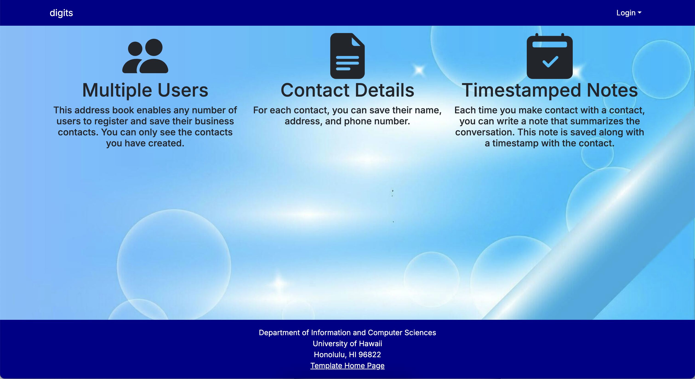
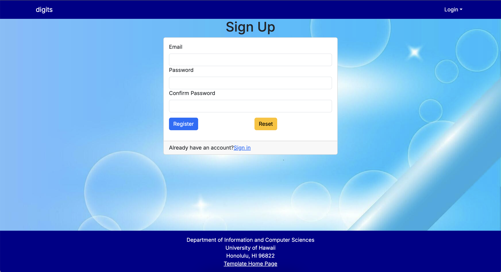
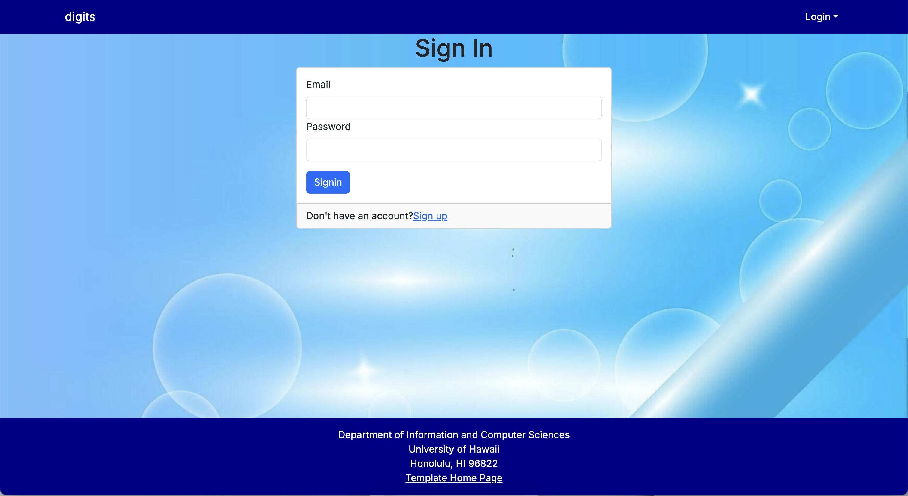
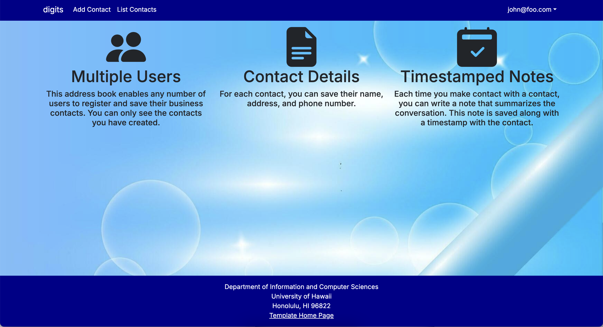
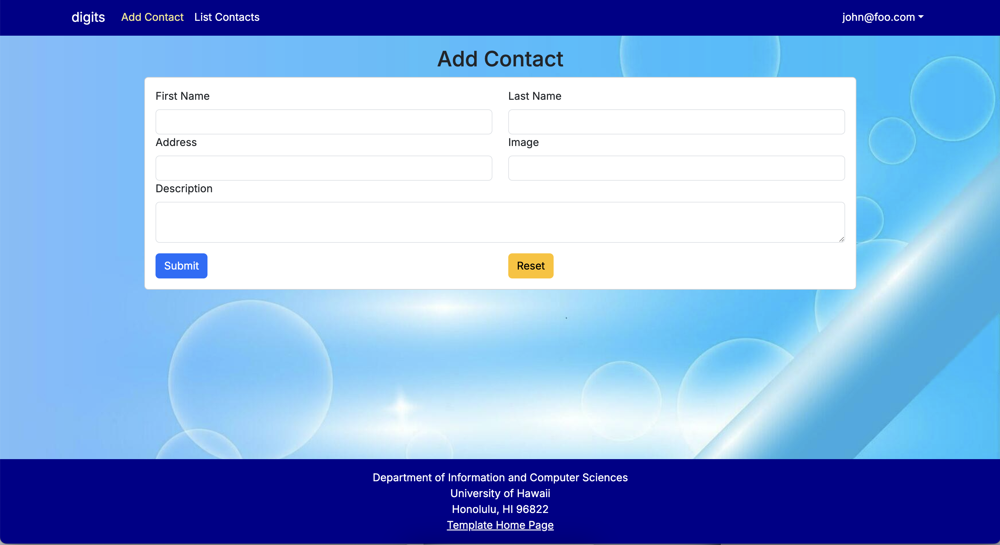
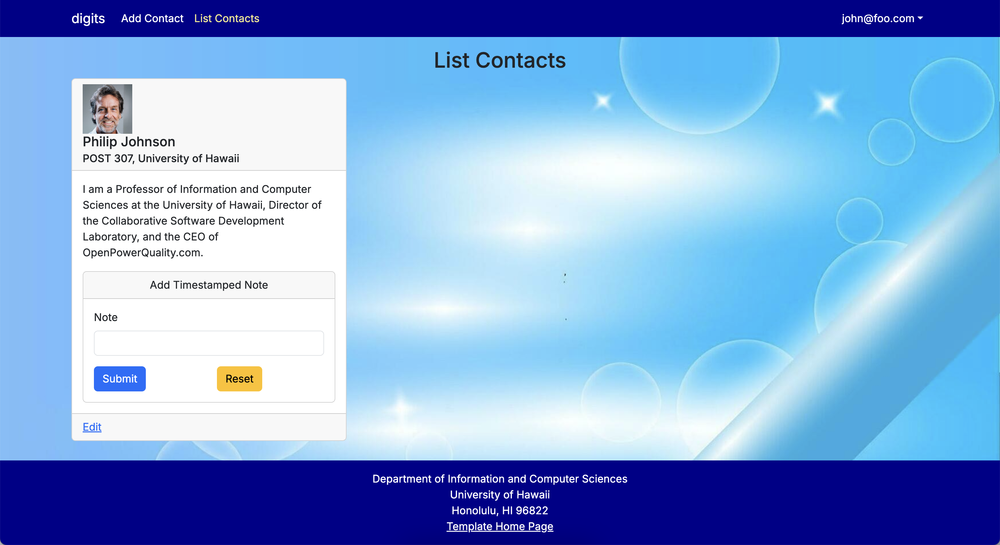
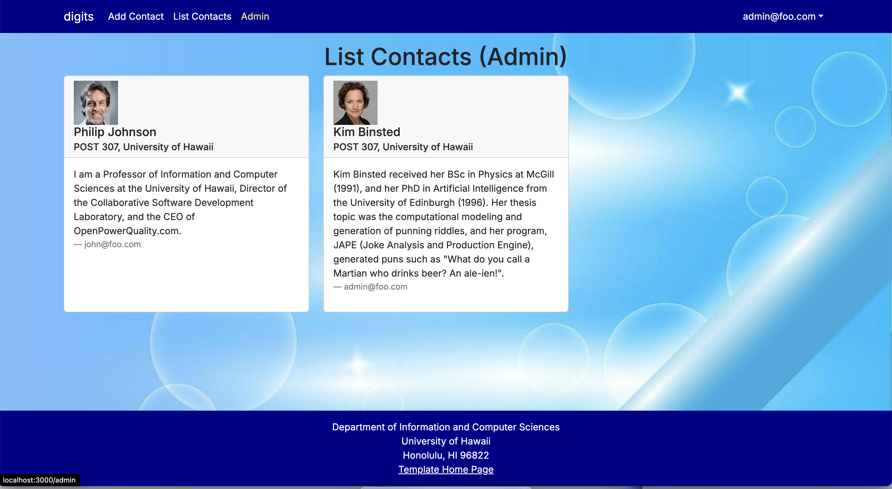

digits is an application that has been modified from nextjs-application-template. 

This application allows users to:
- Register an account.
- Create and manage a set of contacts.
- Add a set of timestamped notes regarding their interactions with each contact.

## Walkthrough

### Landing Page

This is the first page you will see when you open the application. 
It contains basic information about the functions of the application.

## Sign Up

If you don’t have an account, click 'Login' to sign up for a new one.

## Sign In

If you already have an account, click 'Login' to sign in. 

## Home Page

After signing in, you will be directed to the homepage. 
It appears similar to the landing page, but the navbar is updated to provide additional functionality.

## Add Contact

This page allows you to add a contact to the list.
After filling out the form, click 'Submit'.

## List Contacts

This page allows you to view all the contact lists you have added.
You can also add multiple timestamped notes and edit information for any contact.

## Admin

If you have the admin role on the website, you have access to this special page.
This page lists all contacts associated with all users.